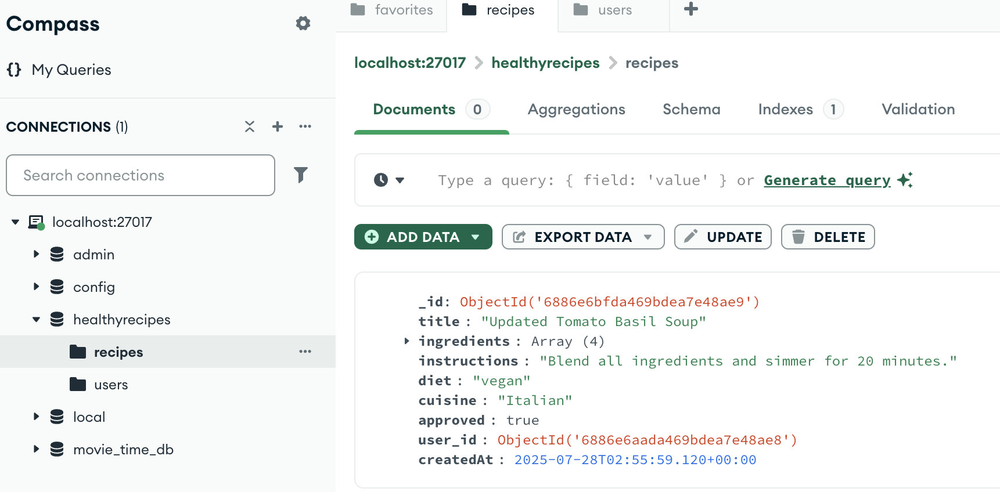
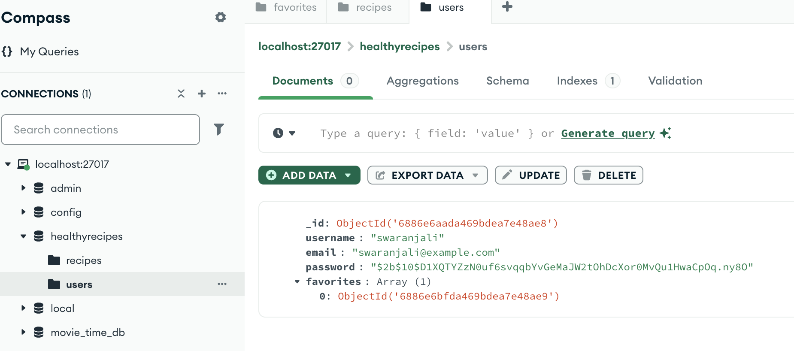
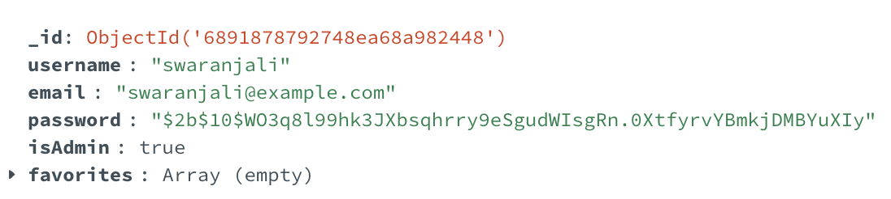
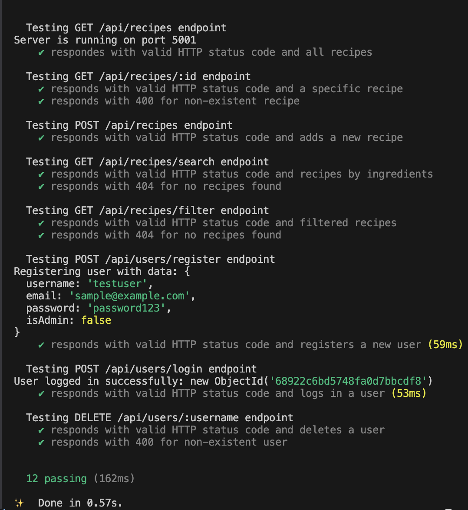
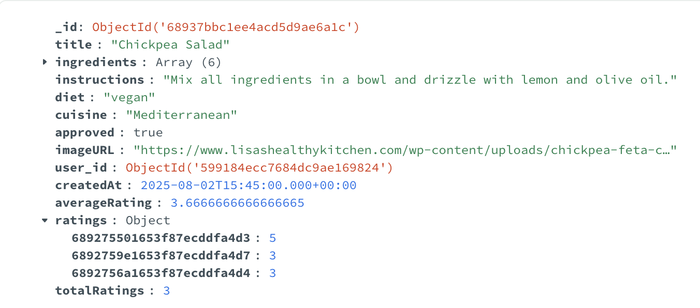

# Healthy Recipe Finder – Backend
This is the backend service for the **Healthy Recipe Finder website**

## Swaranjali Kulbhushan Lamkane's contributions:

### 1. Initial Backend Setup
- Created backend project structure.
- Initialized the project using `npm init`.
- Added core entry files: `index.js` and `server.js`.
- Installed essential dependencies:
  - `express`
  - `cors`
  - (and others as needed)

---

### 2. MongoDB Setup
- Created following in mongododb compass.
- Database name: `healthyrecipes`.
- Collections: recipes and users

---

### 3. Implemented following REST API Endpoints

#### Recipe Endpoints

| Method | Endpoint | Description |
|--------|----------|-------------|
| `GET` | `/api/recipes` | Get all approved recipes |
| `GET` | `/api/recipes/search?ingredients=a,b,c` | Search recipes by ingredients |
| `GET` | `/api/recipes/:id` | Get single recipe by ID |
| `POST` | `/api/recipes` | Submit a new recipe (user-contributed, auto-approved for now) |
| `GET` | `/api/recipes/filter?diet=vegan&cuisine=indian` | Filter recipes by diet and cuisine |
| `PUT` | `/api/recipes/:id` | Update an existing recipe (admin) |
| `DELETE` | `/api/recipes/:id` | Delete a recipe (admin) |

#### User Authentication

| Method | Endpoint | Description |
|--------|----------|-------------|
| `POST` | `/api/users/register` | Register a new user |
| `POST` | `/api/users/login` | Log in an existing user |

#### Favorites Functionality

| Method | Endpoint | Description |
|--------|----------|-------------|
| `GET` | `/api/recipes/favorites/:userId` | Get all favorite recipes for a user |
| `POST` | `/api/recipes/favorites/:userId/:recipeId` | Add a recipe to user's favorites |
| `DELETE` | `/api/recipes/favorites/:userId/:recipeId` | Remove a recipe from user's favorites |

- A screenshot of the recipe added in database using '/api/recipes' POST endpoint
  
  

- A screenshot of the user added in database using '/api/users/register' POST endpoint
  
  

4. Added error handling for all controllers.
5. Added support for pagination for get all recipes, filter by diet and cusine and search by ingredients endpoints.
6. Added an isAdmin flag to the users schema so that only admins can access the recipe review page, where they can approve or reject recipes to maintain the website's healthy recipes goal.  

    

7. Added automated API tests for all endpoints using mocha chai and supertest.

   

8. Fixed api to submit ratings and get ratings summary. Below is the screenshot of added ratings in the database for a recipe.

    

---

## Esther Mukuye
### Iter2
- To make testing and development easier, a MongoDB dump is included in the backend project under the `dump\` folder. For now it includes collections such as recipes and users
  - To restore the command locally, run this command `mongorestore --db healthyrecipes ./dump/healthyrecipes`
- Added a new search route:
   - GET /api/recipes/search?ingredients=...&diet=...&cuisine=...
- Updated the `RecipesDAO.searchRecipes()` function to filter recipes using:
  - $in with regular expressions for ingredient matching (case-insensitive)
  - Exact match for diet and cuisine
  - approved: true filter to ensure only verified recipes appear
- Used ingredients.split(",") in the controller to process frontend input into an array
- Implemented `recpise.controller.apiSearchRecipes` so that only one query is sent to database for recipes list based on filters.

### Iter3
- Updated POST `/api/recipes/favorites` method in `recipes.route.js` that adds a recipe to a user’s favorites (accepts `userId` and `recipeId` in request body)

- Updated `favorites.controller.js` to:
  - Parse userId and recipeId from params or request body as needed
  - Return detailed recipes along with favorite IDs

- Updated `FavoritesDAO.js` to:
  - Fetch recipe details by joining favorite IDs with the recipes collection

## 🛠️ How to Run Locally

```terminal
yarn install
yarn start
```

## Arushi Gupta
- Added imageURL to the create recipe code as it's a required field that users will need to put as part their submission.

- Added in the backend features to submit and update star ratings for their recipes. 
- Added in features to get ratings, average ratings, and total number of ratings.

Files modified: 

RecipesDAO.js
Updated methods to include ratings in get methods and update recipe methods.
Added in functionality to average out ratings after total ratings is updated and renewed.
