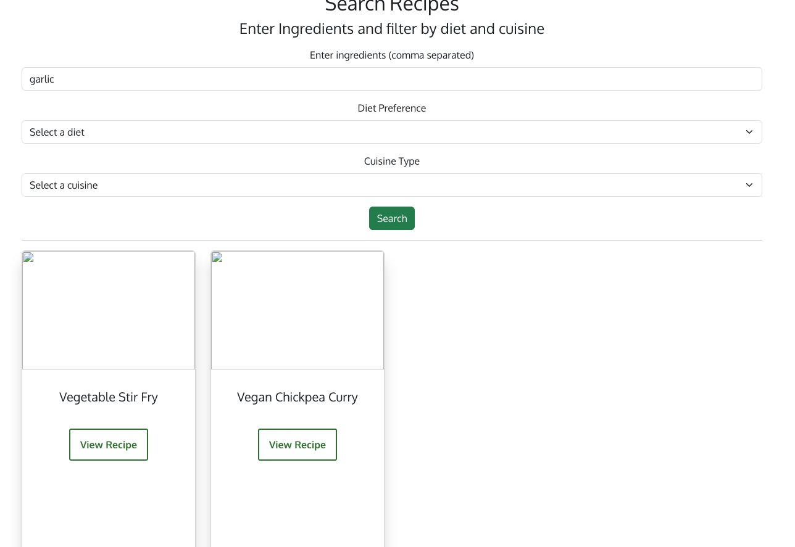
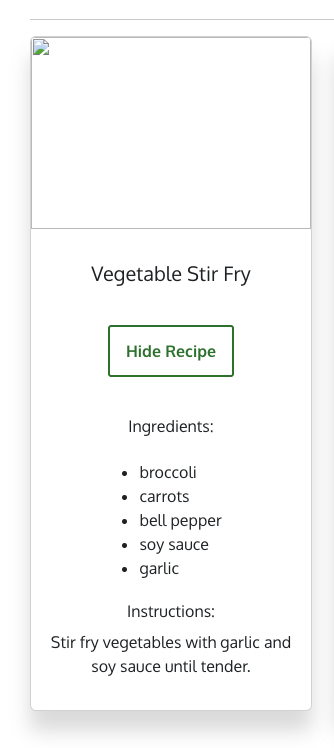
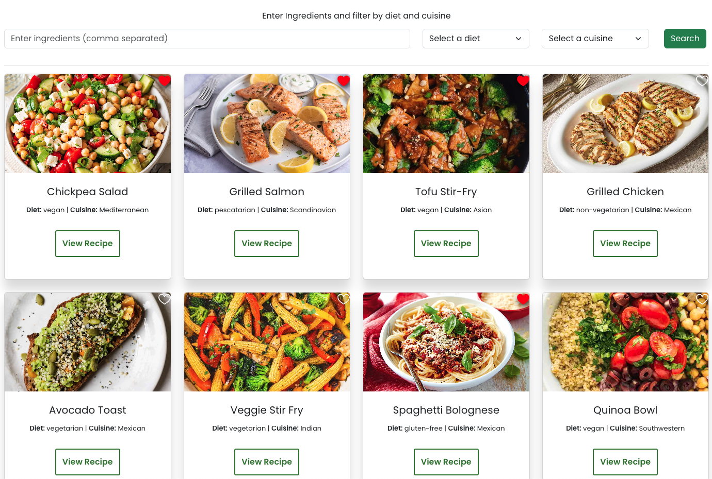
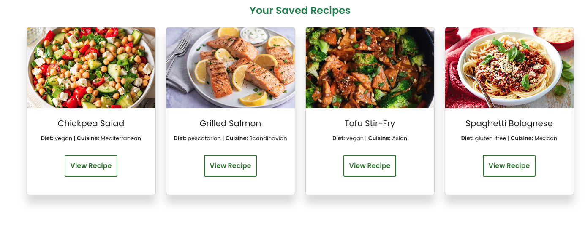
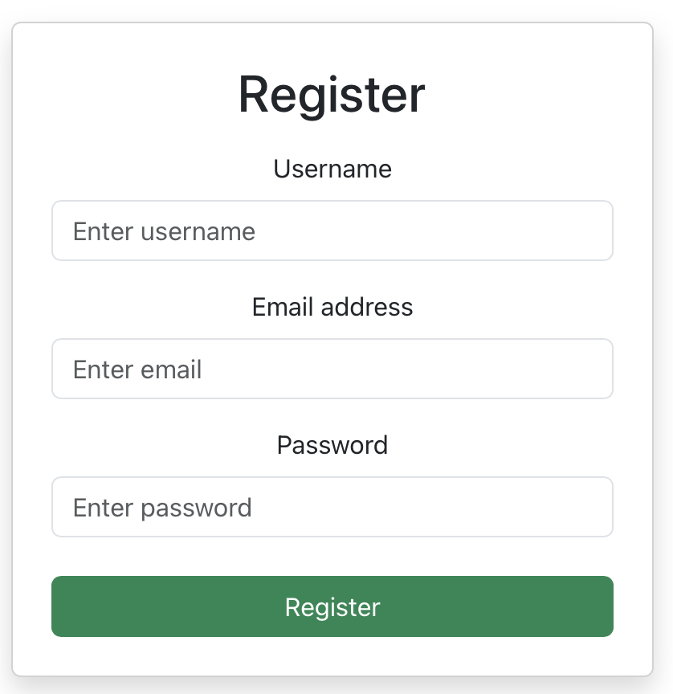
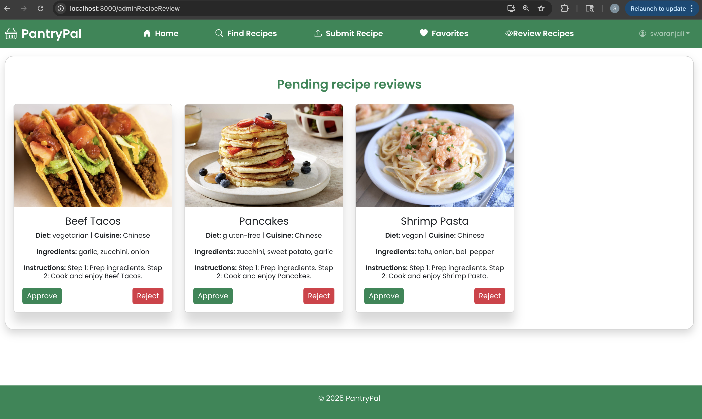
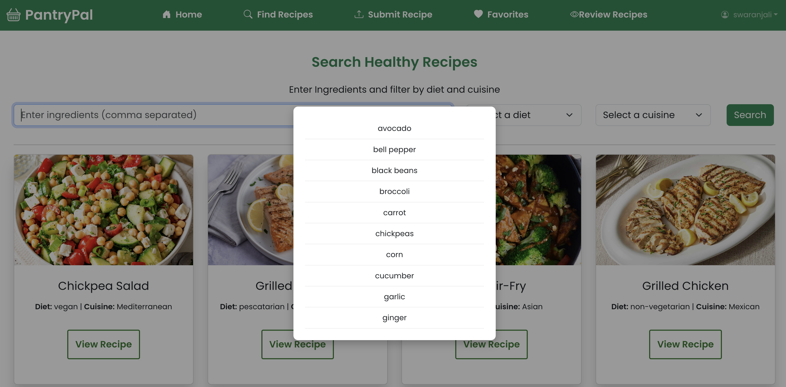
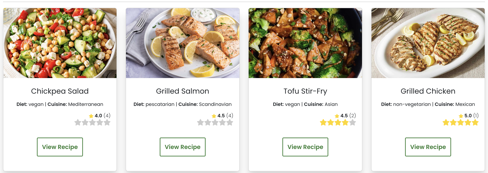

# PantryPal Website
This project is a Recipe Search website where users can search for recipes based on ingredients, diet, and cuisine. The website allows users to input ingredients separated by commas, and it filters through a list of pre-defined recipes to find matches. Users can also favorite recipes they like or upload new recipes for admins to approve. The front-end is styled for a smooth and visually appealing user experience.

## Arushi Gupta's Contribution:
Added in key Features like all the pages, styling, search boxes, drop downs, and frontend pages.
Ingredient Search: Users can enter ingredients separated by commas, and the app will search and display recipes that contain all of the entered ingredients.

Dropdowns: Users can filter options based on a diet or cuisine they are following from the options available.

Responsive Layout: The app is designed with a laptop-friendly layout using flexible styles.

Buttons: Interactive for category selection, buttons for triggering actions (e.g., search, reset), and other essential user controls.

User-Friendly Interface: A clean and simple UI with intuitive user features for a seamless experience.

Pages & User Interface
1. Homepage
Contains the menu bar for options/services.

A search button connects to the search page.

Menu pages are displayed.

2. Search Functionality
Users can type ingredients into a search box, separated by commas. Or they can click on already established options using dropdown of diet and cuisine.

3. Submit Functionality
Users can type out the specifics of a recipe that follows the same schema in our backend and submit the recipe.

Added in image capabilities so users have to input an Image URL as part of their submission.

4. Favorite Functionality
Shows a placeholder for no recipes clicked as of now.

5. Admin Review Recipes Page
Created a page for admins to review recipes and the router to app.js

## Esther Mukuye
#### Iter1
- Implemented RecipeDataService too centralize all API calls using axios and added methods to:
    - Retrive all recipes (with pagination)
    - search for recipes by cuisine or other fields
    - fetch a recipe by id
    - create, update a recipe

- Refactored the main homepage from static HTML to a dynamic React component `App.js` using JSX
- Implemented user functionality in `App.js` file, wrapped the app with `GoogleOAuthProvider` to enable future user authentication features
- Intergrated React Router to enable smooth client-side navigation between
    - Home (/)
    - Search Recipes (/search)
    - Submit Recipe (/submit)
    - Favorites (/favorites)
    - login (/login)
    - Start Searching(/startSearching)

- Refactored redundant (header and footer) code in Page files and moved it to Layout.js
- Added css styling to enable functional and pleasant user functionality

#### Iter2
- Updated the `SearchRecipesPage`. to show recipes displayed in responsive Bootstrap cards using `GET request` when filters are submitted and search button is clicked

   - Clicking `View Recipe` expands the card to show the ingredients and instructions

- Updated the GET /api/recipes/search endpoint to:
   - Parse and filter by ingredients, diet, and cuisine (using MongoDB queries)
   - Return only recipes matching all selected filters
- Added a new search route:
   - GET /api/recipes/search?ingredients=...&diet=...&cuisine=...
- Parsed query parameters (ingredients, diet, cuisine) from the request.
- Updated the recipe query logic to filter results based on: 
   - ingredients using MongoDB’s $all or $in 
   - diet and cuisine using exact match
- Ensured the backend returns only recipes that match all selected filters
- Implemented expand/collapse functionality so users can view each recipe’s ingredients and instructions without leaving the page.

#### Iter3
1. Created `favorites.js` service to manage all API calls:
  - `getAllFavorites(userId)` -> fetch all favorites
  - `addFavorite(userId, recipeId)` -> add recipe to favorites
  - `removeFavorite(userId, recipeId)` ->  remove recipe from favorites
  - `updateFavoritesList(userId, favoritesArray)` -> replace full favorites list

2. Updated `App.js`:
  - Added state for `favorites` (IDs) and `favoriteRecipes` (full objects)
  - Implemented `addFavorite` and `deleteFavorite` functions with optimistic UI updates followed by backend sync
  - Integrated `retrieveFavorites` to load favorites on login

3. Updated UI Components:
  - `StartSearchingPage` -> toggle heart icon to add/remove favorites
  - `FavoritesPage` -> display saved recipes in responsive Bootstrap cards with option to expand and view details
  
- Screenshot of StartSearchingPage showing the favorited recipes

- Screenshot of Favorites Page

## Swaranjali Kulbhushan Lamkane:
     
### Iteration 1

 1. Added bootstrap icons for each nav items on the header nav bar.

 2. Added a background image to the home page and adjusted the CSS to display the "Start Searching" button and description in the foreground of the image.

 3. Implemented UserDataService to enable API calls to the backend to register and login user.
 - Screenshot of the homepage

    
    
        
### Iteration 2

 4. Added Register user functionality

    

 5. Added email login support on the Login Page, allowing users without a Gmail account to create a free account and log in to our website.

      
 6. Added backend connectivity for submit recipe page so that users can submit recipe to the database. 
   - Screenshot of successful recipe submission
      

 7. Added a route and nav item for the Admin Recipe Review page, which will only be visible to users with admin privileges after they log in.

 8. Implemented the Admin Recipe Review page with backend API calls, styling, and logic to approve or reject recipes. This page is accessible only to users with admin privileges and helps maintain the website’s goal of promoting healthy recipes. Admins can either approve or delete submitted recipes from this page.

    Please log in using the sample admin account below to view this page:
 - email: swaranjali@example.com
 - password: securepassword123

    

 9. Added logic to display all approved recipes on page load of the Recipe Search page, fixed the issue with the multiple-ingredient search filter, and updated the styling. Now page looks like this:
      

### Iteration 3

 10. Added suggestions popup that appears when users enter ingredients on the Recipe Search page:

           

 11. Added a view to enable users to submit ratings, and to display the average rating along with the count of ratings submitted by users.
 
      